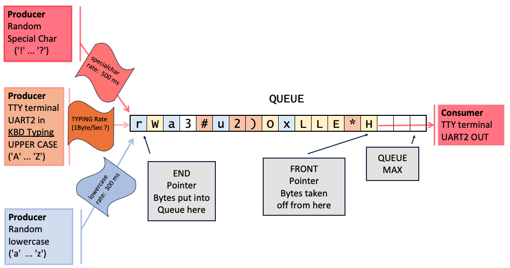
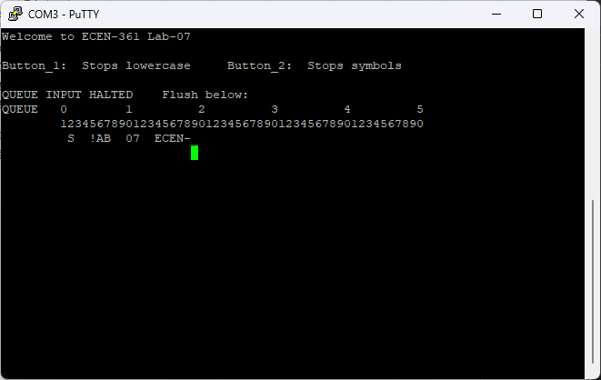
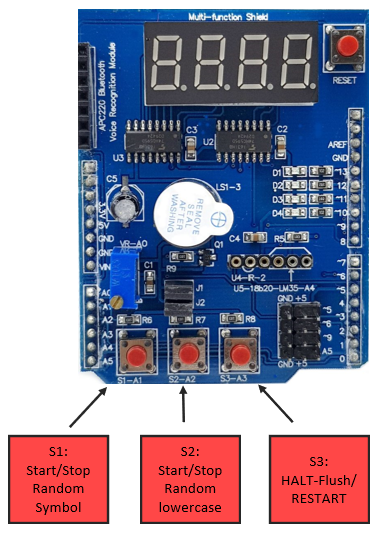

# ECEN-361 Lab-07:Queues and IPC

## Introduction and Objectives of the Lab

This lab will introduce the concept of interprocess communication mechanisms, particularly queues and task messages. This will be done in the framework of FreeRTOS middleware as supplied by the STM32 ecosystem. Semaphores are also a means of simply signalling other tasks, but are not covered in this lab.

**Queues**

Queues are a well-known data structure, serving a FIFO strategy to store/forward data. The student has likely programmed with queues in other classes. We take this data structure and move it into an environment where access to the queue is available to multiple producers (tasks that add to the queue), and consumers (tasks that take first-off data from the queue.) Simple everyday analogous systems utilizing this type of structure can be seen in many operations: A tech-support call-center producing many incoming calls at a time, putting them in the queue for service, while many operators pull the calls off to consume and process them.

In FreeRTOS, the queue structure is global in nature, and available to be written-to and read-from most any other process. In general, processes will be dedicated to handing one or the other operation – either producing or consuming. Events (interrupts) can be setup to signal on various states of the queue: EMPTY, FULL, FILLED-to-a-LEVEL, etc. These can a be the source of interrupts and exceptions in processing. The queue can be configured to store any data type.

For this lab we will build a small queue pipeline with three producers, and 1 consumer. Elements that go into the queue pipeline are from the superset of all ASCII characters, but each producer has the unique quality that they deliver only subsets of the full character set, so:

**Producers**

1. Random symbols, punctuation, etc. [**‘!’ ...’=’**] (from character ‘!’ to ‘=’ in ASCII table)
    One character issued per 700mS
2. Typed Uppercase Letters (from keyboard – PuTTY)  
    One character per keystroke – about 200mS (however fast you can type!)
3. Random lowercase letters [**a..z**]  
    One character issued per 400mS   
    **(to be completed by student in Part 1)**

**Consumer**:

1. Reads the queue once every second and displays items on the queue
2. Halt and Dump  
   This consumer looks for the letter ‘Q’ being put the queue, then dumps the entire queue and stops production sources,  
   **(to be completed by student in Part 3)**

**Other Processes**

Status: Using the 7-Seg LEDs, the running count of of bytes currently in the queue is displayed. If ever the queue is empty or full, the display shows: “**----**” or “**FuLL**“, respectively.

The following is a simple diagram of a queue being fed by all three sources. As shown, the queue not full and no priority scheme is implemented between the producing tasks.

Color-coding of the item shown in the queue is added to show the source of that item.

There is also control on the production: a dedicated button start/stops each of the following producers.

- The Random Character Producing Task Button_1 Start/Stop
- The Random lowercase character Production Task Button_2 Start/Stop  
  **(to be completed by student in Part 2)**

As given to the student, there is a single consumer outputting process which waits for data availability then sends that data to the USART2 out. (USB TTY via PuTTY).

Note that keystrokes typed into the UART keyboard (via the TTY Terminal) are ‘filtered’ before being put onto the queue. This type of pre-processing is typical and could be likened to a real-world example of a tech-support site sending customers with different types of issues into different waiting queues.

In this code, all keystrokes typed are checked to see that they are strictly alphabetic [‘A’ … ‘z’] and then added to the queue only as uppercase. This allows us to determine the source of the item in the queue, by the type of data: uppercase, lowercase, and special-characters all can come only from their unique source producer.

## Part 1: Examine the existing code and operation

1. Verify that the queue is adding random characters (7-seg count is increasing)
2. Bring up your terminal emulator (PuTTY, etc.) and observe the characters being put into the queue  
      (random characters inserted with typing):  
      

Now look through the code a bit and answer the following questions.

## Part 1: Questions (2 pts)

* How are the interrupts for the buttons used to start/stop the respective producers for the Queue?
  
  <mark>[*answer here*]</mark>

* Only uppercase characters are being shown in the queue. Are these just being shown as upper, or converted to upper before being pushed onto the queue?  Where is the line of code that does this?
  
  <mark>[*answer here*]</mark>

## Part 2: Add producer and consumer routines

Note that the tasks to add the random characters are S/W timers. These are just like H/W timers, but don’t have an interrupt line. They are started in S/W and then execute a callback when they expire. They can be configured in the .IOC GUI as well. Note the callback routine name is defined here as well:

The timers are configured as a part of the FREERTOS (since they are S/W based). These timers are set to be periodic – so they produce their characters repeatedly at a consistent interval.

Complete the skeleton process to start inserting random lowercase characters. Note the setup parts necessary to add a process are included,for you, see the lines:

- `void Add_Random_lowercase_to_Queue(void *argument); //(the function prototype)`
- `void Add_Random_lowercase_to_Queue(void *argument) //(this is the timer callback)`
- `lowercaseTimerHandle = osTimerNew(Add_Random_lowercase_to_Queue, *osTimerPeriodic*, NULL, \&lowercaseTimer_attributes); //(this enables the S/W Timer)`
- `osTimerStart(lowercaseTimerHandle,Random_lowercase_Timer_Speed);`

## Part 2: Questions (4 pts)

* How are the interrupts for the buttons used to start/stop the respective producers for the Queue?
  
  <mark>[*answer here*]</mark>

* Paste a screenshot of the TTY with the Queue now filling with all three sources:
  Typing (‘A’ .. ‘Z’);   random characters (‘!’ .. ‘=’);   and your new random lowercase (‘a’ .. ‘z’) producing task
  
  <mark>[*screenshot here -- place image in the media/ directory*]</mark>

## Part 3: Define a “HALT” button

The code as distributed has defined two of the three buttons. In this part you’ll define the third to be a “HALT.”

Currently, they are defined:

**S1**: Start/Stop RandomSymbols from being put in the Queue

**S2**: Start/Stop Randome lowercase letters from being put in the Queue

**S3**: HALT/RESUME taking characters from Queue. Upon halting, flush the Queue  
(TO BE DONE BY STUDENT)

Queue applications may have conditions that call for a stop to processing: maybe a call-operator has to take a break, or the potato truck is full and the next truck needs to come to be filled, some contaminated ingredients were introduced into the assembly line, etc.

For the last part, let’s make a “HALT/RESTART” button that does the following:

- Disable further input (halt all the producers). See how it’s done with buttons **S1** and **S2**.
- Print a “Halting message” on the TTY
- Pull all the contents off the queue and print them

## Extra Credit (5 pts maximum)

Do any one of the following, or submit something interesting of your own for extra credit.

* Currently, the data is taken out of the queue only once every “read_pacing_delay” milliSeconds.  Add an option to change that queue read speed by way of user input.  If you add little decoding in the routine where a typed character is received, you could speed-up or slow-down the read pacing.  (That routine is: `HAL_UART_RxCpltCallback()` and already converts any character to upper case.   For example, you could make the “+” key make it go faster by lowering the pacing by 100mS.
  
  Write about what you did – and what keys do what now:
  
  <mark>[*answer and screenshot/video link here*]</mark>

* Add another producer that adds other “extended characters into the queue, randomly chosen, like the `Add_Random_Symbols_to_Queue()`.  For this producer, output characters that are in the other half of the ASCII table – 0x80 … 0xFF ;
  
  Paste in a small screenshot of what these characters look like on your TTY.  You may want to change character set in PuTTY to be Translation/ISO-8859
  
  <mark>[*answer and screenshot/video link here*]</mark>

* You’ll notice that the ‘random’ sequences always start the same after every reset.  Look into using the srand(unsigned seed)  routine to give a more random seed so that your routine is different on every start up.  Maybe use a counter or a button press? Other ideas?  Get something that works?
  
  <mark>[*answer and screenshot/video link here*]</mark>

* The total count is displayed on the 7-seg display, but you could write a routine that turns on an LED matching the source.  For example: D1 => TTY press, D2 => randomSymbol, D3=>randomlower.
  
  <mark>[*answer and screenshot/video link here*]</mark>
